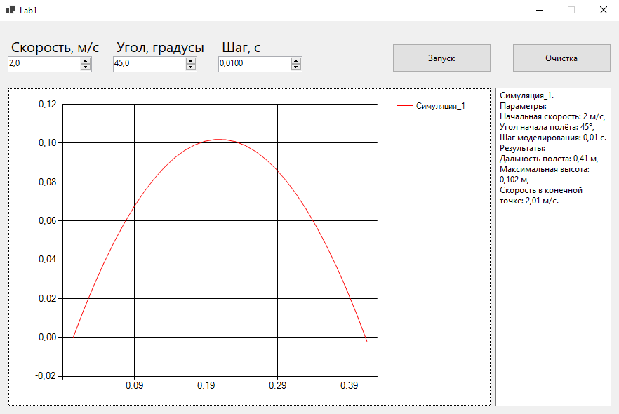
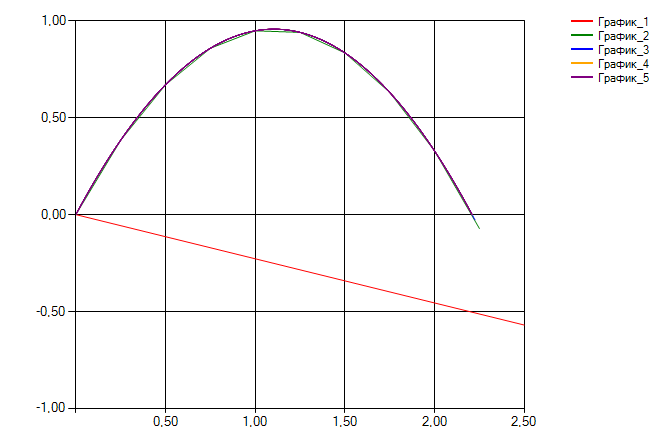

### Лабораторная работа №1  
**Задача**  
Реализовать приложение для моделирования полёта тела в атмосфере.  
Предусмотреть возможность ввода шага моделирования и вывода результатов.  
Приложение было написано на языке *C#* в *Visual Studio* с помощью *WinForms*.  
Для моделирования были использованы следующие формулы:  
vx(0) = v0 * cos(a),  
vx(t + dt) = vx(t) - k * vx(t) * v(t) * dt,  
vy(t + dt) = vy(t) - (g + k * vy(t) * v(t)) * dt,  
v = sqrt(vx ^ 2 + vy ^ 2),  
x(t + dt) = x(t) + vx(t + dt) * dt,  
y(t + dt) = y(t) + vy(t + dt) * dt,  
где k = (C * S * ro) / 2m.  
v0 - начальная скорость, м/с;  
vx - скорость по x, м/c;  
vy - скорость по y, м/c;  
v - общая скорость, м/c;  
a - начальный угол полёта, градусы;  
x - координата тела по оси Ox, м;  
y - координата тела по оси Oy, м;  
m - масса тела, кг;  
C - коэффициент лобового сопротивления;  
S - площадь поперечного сечения, м^2;  
ro - плотность воздуха (= 1,29 кг/м^3);  
g - ускорение свободного падения (= 9,8 м/c^2).  
**Пример работы приложения**  
Интерфейс приложения после запуска одной симуляции:  
  
Проведём 5 симуляций с одинаковыми для каждой параметрами:  
стартовая скорость = *10 м/c*,  
начальный угол = *45°*,  
масса объекта = *20 кг*,  
площадь поперечного сечения объекта = 5 *м^2*,  
коэффициент лобового сопротивления = 0,15.
Каждая симуляция будет иметь на порядок меньший шаг моделирования, начиная *1 с* и заканчивая *0,0001 с*.  
Картинка, показывающая траектории симуляций:  
  
Таблица, отображающая результаты каждой симуляции:
| Шаг моделирования, с | 1 | 0.1 | 0.01 | 0.001 | 0.0001 |
|----------------------|---|-----|------|-------|--------|
| Дальность полёта, м |5,361|8,072|8,559|8,597|8,6|
| Максимальная высота, м |0|1,946|2,282|2,316|2,32|
| Скорость в конечной точке, м/с |6,96|8,167|8,491|8,511|8,514|

**Вывод**  
При решении задач, связанных с имитационным моделированием, очень важно правильно подбирать  
шаг моделирования. При слишком большом шаге моделирования точность результатов может быть неудовлетворительной,  
но при уменьшении шага в определённый момент прирост точности результатов становится слишком маленьким,  
чтобы оправдывать дополнительные временные затраты.
