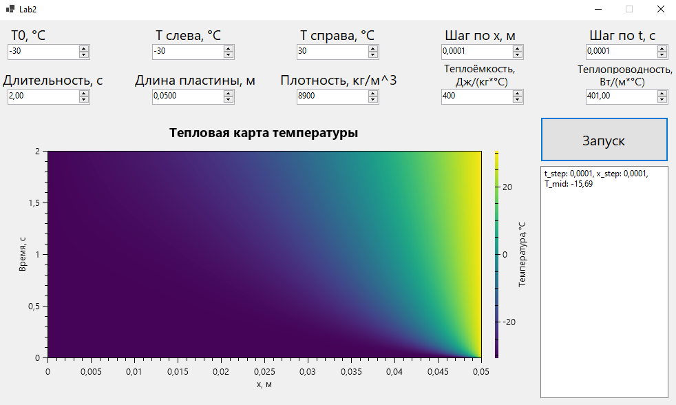

### Лабораторная работа №2  
**Задача**  
Реализовать моделирование изменения температуры в пластине на основе одномерного уравнения теплопроводности с  
использованием метода конечных разностей.  
Выполнить моделирование с различными шагами по времени и пространству.  
Заполнить таблицу значений температуры в центральной точке после 2 секунд модельного времени.  
Приложение было написано на языке *C#* в *Visual Studio* с помощью *WinForms*.  
Начальные условия:  
t = 0: T = T0, 0 <= x <= L,  
x = 0: T = Tл, t >= 0,  
x = L: T = Tп, t >= 0.  
Для моделирования были использованы следующие формулы:  
Коэффициенты **alpha** и **beta**, вычисляющиеся во время прямой прогонки:  
alpha_i = A_i / (B_i - C_i * alpha_i-1),  
beta = (C_i * beta_i-1 - F_i) / (B_i - C_i * alpha_i-1),  
где A_i, B_i, C_i, F_i - коэффициенты, высчитываемые по формулам:  
A_i = C_i = lambda / h^2,  
B_i = ((2 * lambda) / h^2) + (ro * c / theta),  
F_i = -(ro * c / theta) * T_i_n.  
Формула вычисления значений T во время обратной прогонки:  
T_i_n+1 = alpha_i * T_i_n + beta_i.  
*Пояснения*:  
T_i_n - температура в i-ой позиции пластины в n-ый момент времени, *°C*;  
T0 - температура пластины в начальный момент времени, *°C*;  
Tл - температура слева от пластины, *°C*;  
Tп - температура справа от пластины, *°C*;
L - длина пластины, *м*;  
t - время, *с*;  
theta - шаг во времени, *с*;  
x - координата оси Ox, *м*;  
h - шаг по оси Ox, *м*;  
ro - плотность тела, *кг/м^3*;  
c - удельная теплоёмкость, *Дж/(кг\*°C)*;  
lambda - коэффициент теплопроводности, *Вт/(м\*°C)*;  
**Пример работы приложения**  
Интерфейс приложения после запуска одной симуляции:  
  
Проведём 16 симуляций с одинаковыми для каждой параметрами:  
Материал пластины - **медь**,  
плотность (*ro*) = 8900 *кг/м^3*,  
удельная теплоёмкость (*c*) = 400 *Дж/(кг\*°C)*,  
коэффициент теплопроводности (*lambda*) = 401 *Вт/(м*°C)*,  
длина пластины (*L*) = 0,05 *м*,
начальная температура (*T0*) равна температуре слева (*Tл*) = -30 *°C*,  
температура справа (*Tп*) = 30 *°C*.  
Будем моделировать 2 секунды.  
Запишем в таблицу температуру (*°C*) в центре пластины на момент второй секунды для различных шагов по времени и пространству:  
|Шаг по времени, с \ Шаг по пространству, м|0.1|0.01|0.001|0.0001|
|-------------------------------------------|-----|------|-------|--------|
|0.1|0|-15,1|-15,98|-15,98|
|0.01|0|-14,87|-15,72|-15,72|
|0.001|0|-14,84|-15,69|-15,69|
|0.0001|0|-14,84|-15,69|-15,69|

Можем заметить, что при h = 0,1 *м* температура в центре всегда равняется 0, т.к.  
пластина всего 0,05 *м*, а значит для нахождения температуры в центре происходит  
усреднение температур с разных краёв: (-30 + 30) / 2 = 0.  
Также по таблице видно, что уже h = 0,001 *м* и theta = 0,001 *с* достаточно  
для достижения удовлетворительной точности.  
**Вывод**  
Вывод аналогичен таковому из первой лабораторной.  
При решении задач, связанных с имитационным моделированием, очень важно правильно подбирать  
шаг моделирования. При слишком большом шаге моделирования точность результатов может быть неудовлетворительной,  
но при уменьшении шага в определённый момент прирост точности результатов становится слишком маленьким,  
чтобы оправдывать дополнительные временные затраты.
