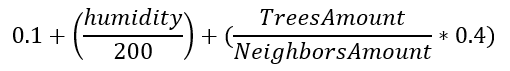
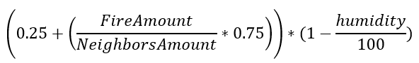
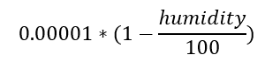
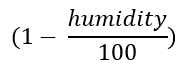
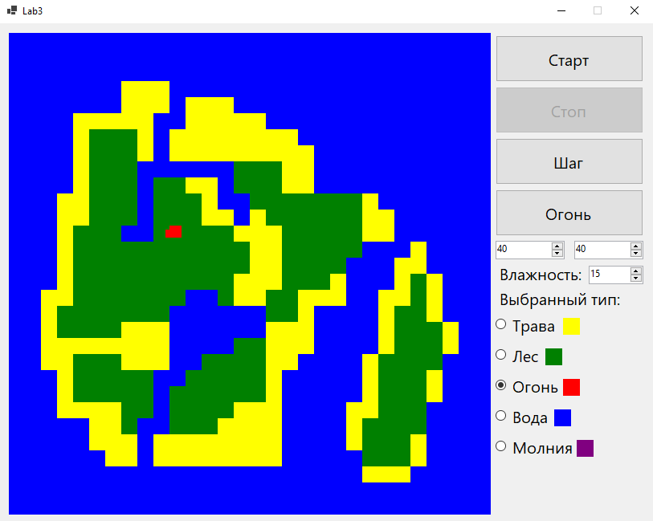
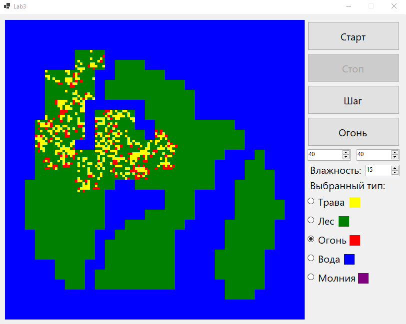

### Лабораторная работа №3
**Задача**
Реализовать моделирование возникновения и распространения лесных пожаров с использованием  
двумерного клеточного автомата. Реализовать не менее трёх дополнительных правил поведения системы.  
**Решение**  
Приложение было написано на языке *C#* в *Visual Studio* с помощью *WinForms*.  
В модели реализовано 5 состояний клетки:  
1. *Трава* (Жёлтый цвет).  
2. *Лес* (Зелёный цвет).  
3. *Огонь* (Красный цвет).  
4. *Вода* (Синий цвет).  
5. *Молния* (Фиолетовый цвет).

Также учтена влажность, которую можно изменять от 0 до 100.  
Каждая клетка работает с **окрестностью Мура**.  
Возможны следующие смены состояний:  
1. *Трава* -> *Лес*.
*Трава* может превратиться в *Лес* со следующей вероятностью:  
  
где:  
**humidity** - влажность,  
**TreesAmount** - количество *Деревьев* в окрестности,  
**NeighborsAmount** - количество клеток в окрестности (Для обработки границ карты).  
Т.е. вероятность роста *Леса* из *Травы* увеличивается с увеличением влажности и количества *Леса* по соседству.  
2. *Лес* -> *Огонь*.  
*Лес* может превратиться в *Огонь* со следующей вероятностью:
  
где:  
**humidity** - влажность,  
**FireAmount** - количество *Огня* в окрестности,  
**NeighborsAmount** - количество клеток в окрестности.  
Т.е. вероятность превращения *Леса* в *Огонь* увеличивается с ростом *Огня* по соседству,  
но уменьшается пропорционально росту влажности.  
3. *Огонь* -> *Трава*.  
*Огонь* всегда преобразуется в *Траву*.  
4. *Трава* -> *Молния* и *Лес* -> *Молния*.
В *Траву* или *Лес* может ударить можния со следующей вероятностью:  
  
где:  
**humidity** - влажность.  
Т.е. вероятность удара *Молнии* очень мала и обратно пропорциональна росту влажности.  
5. *Молния* -> *Огонь*.  
Место попадания *Молнии* может возгореться со следующей вероятностью:  
  
где:  
**humidity** - влажность.  
Т.е. вероятность возгарания места удара *Молнии* обратно пропорциональна росту влажности.  
**Пример работы**  
Демонстрация интерфейса при запуске приложения:  
  
Приложение позволяет менять влажность.  
Также приложение позволяет менять состояние клеток на карте.  
Демонстрация возможности размещения *Огня* на карте:    
  
Состояние модели после нескольких секунд симуляции:  
  
**Вывод**  
Клеточные автоматы являются довольно удобным инструментом для создания  
наглядных моделей процессов, завязанных на взаимодействии соседних объектов  
в двумерном пространстве.  
