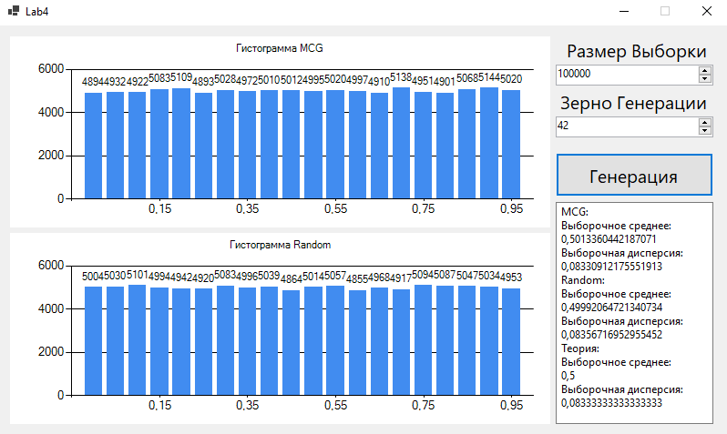

### Лабораторная работа №4  
**Задача**  
Реализовать базовый датчик случайных чисел.  
Вычислить выборочные средние и дисперсию для выборок размером 100000 из  
реализованного датчика и встроенного генератора языка программирования.  
**Решение**  
Приложение было написано на языке *C#* в *Visual Studio* с помощью *WinForms*.  
Базовый датчик был написан на основе **мультипликативного конгруэнтного генератора**.  
Датчик меняет своё состояние согласно формуле:  
x_i = (beta * x_i-1) mod M, где  
M = 2 ^ 63 = 9223372036854775808  
beta = (2 ^ 32) + 3 = 4294967299  
x0 является зерном генерации и задаётся пользователем.  
Когда у датчика запрашивается новое псевдослучайное значение, он  
меняет своё состояние на следующее, после чего возвращает нормированное  
значение нового состояния (x_i / M).  
**Пример работы**  
Интерфейс приложения после генерации выборок размером 100000 с заданным зерном генерации 42:  
  
Как можно увидеть на рисунке выборочные среднее и дисперсия примерно совпадают как  
у реализованного датчика, так и встроенного генератора.  
Также эти значения довольно близки к теоретическим.  
| | Выборочное Среднее | Выборочная Дисперсия |
|---|---|---|
| Реализованный Датчик |0,5013|0,0833|
| Встроенный Генератор |0,4999|0,0836|
| Теоретические Значения |0,5|0,0833|

**Вывод**  
Базовый датчик на основе мультипликативного конгруэнтного генератора  
является довольно эффективным способом генерации равновероятных псевдослучайных  
чисел.
