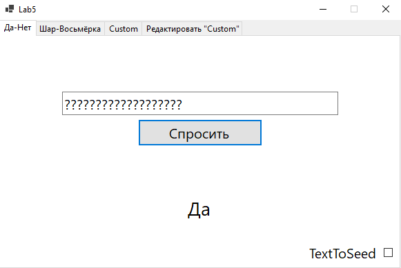
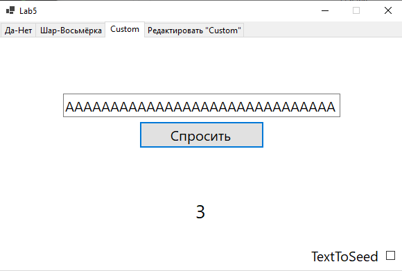
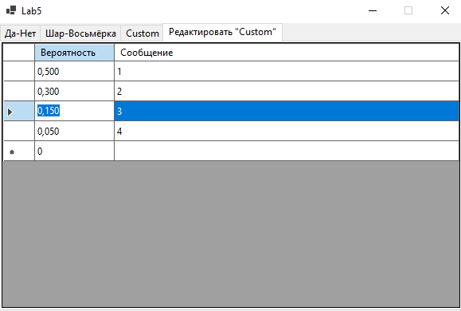

### Лабораторная работа №5  
**Задача**  
Написать приложение, моделирующее "выпадение"  
случайных событий, реализуя:  
"**Скажи "Да" или "Нет"**",  
"**Шар предсказаний (Magic 8-Ball)**".  
**Решение**  
Приложение было написано на языке *C#* в *Visual Studio* с помощью *WinForms*.  
Поделим приложение на вкладки: первая для реализации "**Скажи "Да" или "Нет"**"  
и вторая для реализации "**Шар предсказаний (Magic 8-Ball)**".  
Для "**Скажи "Да" или "Нет"**" определим два равновероятных (*вероятность = 0.5*) события:  
1. "Да",
2. "Нет".

Для "**Шар предсказаний (Magic 8-Ball)**" определим двадцать равновероятных (*вероятность = 0.05*) события:  
1. "Бесспорно",
2. "Предрешено",
3. "Никаких сомнений",
4. "Определённо да",
5. "Можешь быть уверен в этом",
6. "Мне кажется — «да»",
7. "Вероятнее всего",
8. "Хорошие перспективы",
9. "Знаки говорят «да»",
10. "Да",
11. "Пока не ясно, попробуй снова",
12. "Спроси позже",
13. "Лучше не рассказывать",
14. "Сейчас нельзя предсказать",
15. "Сконцентрируйся и спроси опять",
16. "Даже не думай",
17. "Мой ответ — «нет»",
18. "По моим данным — «нет»",
19. "Перспективы не очень хорошие",
20. "Вряд ли".

Интерфейс приложения при запуске:  
  
При нажатии кнопки "Спросить" на соответствующей вкладке  
приложение создаёт список из пар **[вероятность-сообщение]**,  
после чего сортирует его так, чтобы самые вероятные сообщения были первее,  
затем проверяет, что сумма вероятностей равна 1 с погрешностью 1e-10,  
если нет - выводит пользователю сообщение об ошибке.  
Далее мы используем базовый датчик на основе **мультипликативного конгруэнтного метода**.  
Инициализируем датчик временем в текущий момент, либо, если  
пользователь установил галочку TextToSeed, преобразуем введённую пользователем  
в поле строку в число и инициализируем датчик им.  
Далее генерируем датчиком псевдослучайное число.  
После вычитаем из получившегося числа вероятности из списка пар **[вероятность-сообщение]**  
до тех пор, пока псевдослучайное число не станет отрицательным.  
Когда оно стало отрицательным - останавливаемся и выводим пользователю  
соответствующее сообщение из пары **[вероятность-сообщение]**.  
Результат нажатия кнопки:  
  
Также добавим вкладку, реализующую тот же функционал, но с пользовательским набором  
пар **[вероятность-сообщение]**, а также вкладку, позволяющую редактировать этот набор:  
  
  
**Вывод**  
Было написано приложение, позволяющее моделировать  
случайные события, используя базовый датчик на  
основе **мультипликативного конгруэнтного метода** для генерации  
псевдослучайного числа и последовательного вычитания из  
этого числа вероятностей событий, для определения  
случившегося события.
