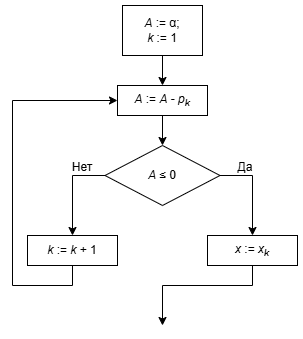
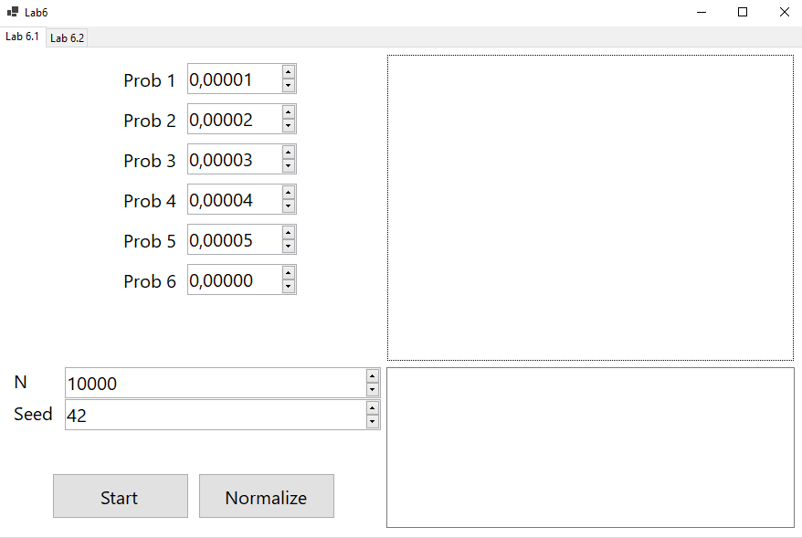
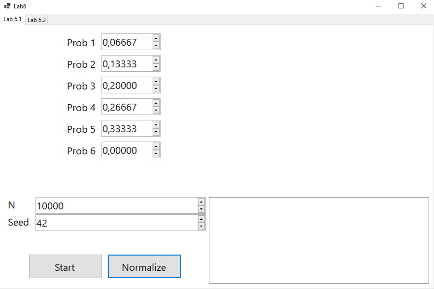
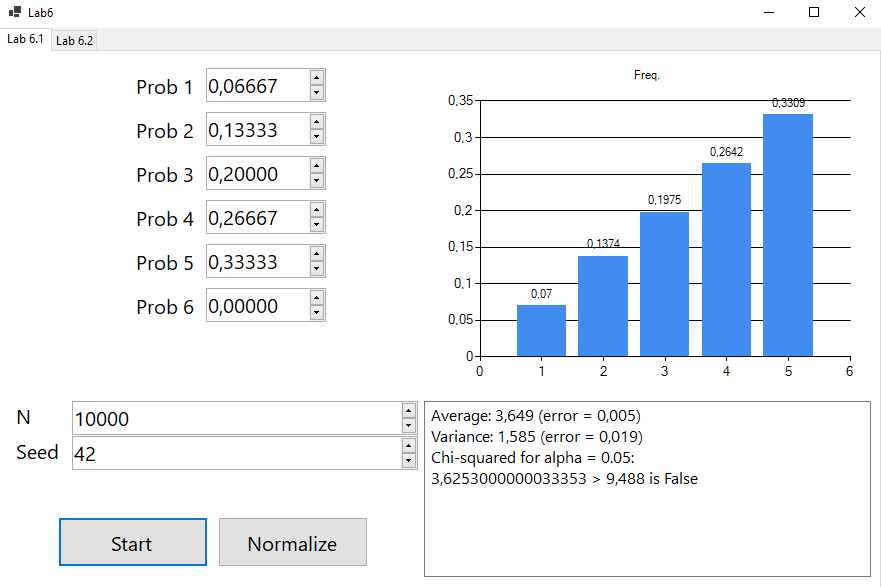
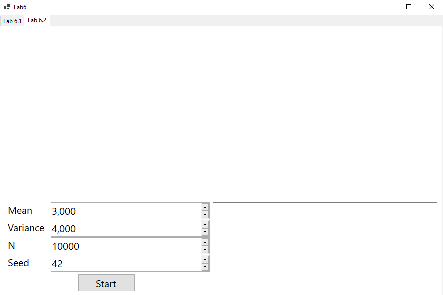
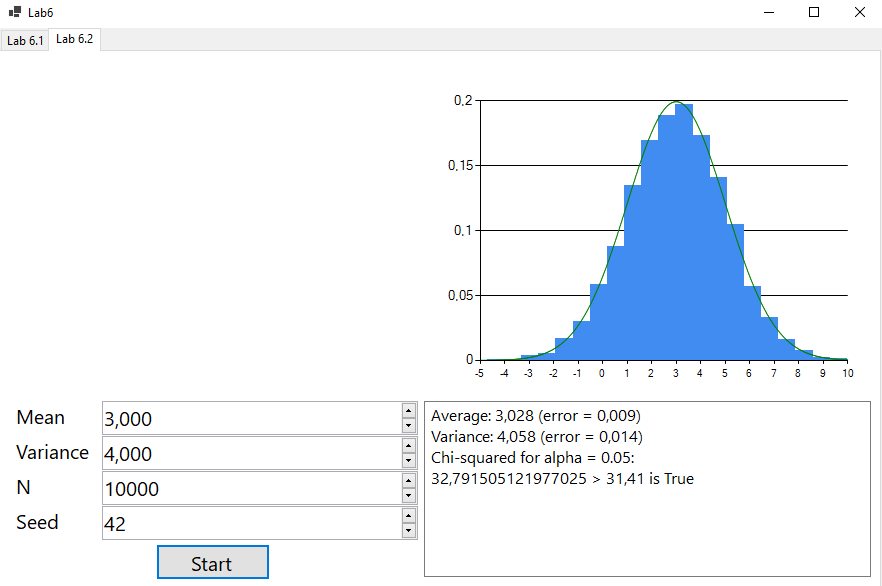

### Лабораторная работа №6  
## Лабораторная работа №6.1  
**Задача**  
Реализовать алгоритм проведения серии экспериментов по генерации дискретной случайной величины, заданной рядом распределения.  
Вычислить эмпирические вероятности, выборочные среднее и дисперсию, их относительные погрешности.  
Вычислить статистику хи-квадрат и применить критерий хи-квадрат при разных объемах выборки N (N = 10, 100, 1 000, 10 000).  
**Решение**  
Приложение было написано на языке *C#* в *Visual Studio* с помощью *WinForms*.  
Для генерации *дискретной случайной величины*, заданной рядом распределения  
используем псевдослучайное значение, созданное *мультипликативным конгруэнтным генератором*,  
а после, используя "схему вычитания", показанную на картинке ниже, определим  
получившееся значение *дискретной случайной величины*.  
  
Вычислим эмпирические вероятности по формуле:  

$$
\hat{p} = \frac{n_i}{N}
$$  

Далее вычислим эмперическое и теоретическое средние:  

$$
\hat{E}x = \sum\limits_{i=1}^{m}\hat{p}_i x_i
$$  

$$ 
Ex =\sum\limits_{i=1}^{m}p_i x_i
$$  

Также найдём эмпирическую и теоретическую дисперсии:  

$$
\hat{D}x = \sum\limits_{i=1}^{m}\hat{p}_i x^2_i - (\hat{E}x)^2
$$

$$
Dx = \sum\limits_{i=1}^{m}p_i x^2_i - (Ex)^2
$$

Вычислим относительные погрешности для среднего и дисперсии:  

$$
\delta_E = \frac{|\hat{E}x - Ex|}{Ex}
$$

$$
\delta_D = \frac{|\hat{D}x - Dx|}{Dx}
$$

Также проверим гипотезу о соответствии эмперического распределения теоретическому с помощью  
критерия **Хи-квадрат** (*Уровень значимости зададим равным 0.05*).  
Вычислим статистику **Хи-квадрат**:  

$$
\hat{X}^2_N = \sum\limits_{i=1}^{m} \frac{n^2_i}{N p_i} - N
$$

Если получившееся значение меньше, чем табличное $\chi^2_{0.95,m-1}$, то гипотеза  
не отверагается, если больше - отвергается.  
**Пример**  
Интерфейс программы:  
  
При нажатии на кнопку *Normalize* вероятности ряда подкорректируются так, что их сумма станет равна 1:  
  
После нажатия на кнопку *Start* выведется диаграмма эмпирических вероятностей, а также  
среднее, дисперсия (*с относительными ошибками*) и результат проверки гипотезы о соответствии эмпирического  
распределения теоретическому:  
  
Для ряда распределения:  

|X|1|2|3|4|
|---|---|---|---|---|
|p|0.1|0.2|0.3|0.4|

Выведем таблицу результатов проверки гипотезы для разных N (*seed = 42, alpha = 0.05*):  

|N|10|100|1000|10000|
|---|---|---|---|---|
|Статистика **Хи-квадрат**|2.333|1.458|2.7|1.56|
|Критическое значение|7.815|7.815|7.815|7.815|
|Отвергаем?|Нет|Нет|Нет|Нет|

**Вывод**  
С помощью сочетания **мультипликативного конгруэнтного генератора** и  
"схемы вычитаний" можно эффективно генерировать дискретный случайные величины  
по заданному ряду распределения.  
## Лабораторная работа №6.2  
**Задача**  
Выполнить моделирование нормальной случайной величины любым методом.  
Провести статистическую обработку результатов:  
1. Построить гистограмму.  
2. Оценить точность (относительные погрешности, критерий хи-квадрат) для объемов выборки 10, 100, 1000, 10000.  

**Решение**  
Приложение было написано на языке *C#* в *Visual Studio* с помощью *WinForms*.  
Для моделирования стандартной нормальной случайной величины будем использовать  
**мультипликативный конгруэнтный генератор** по следующей схеме, основанной на *центральной  
предельной теореме*:  

$$
\zeta = \sum\limits_{i=1}^{12} \alpha_i - 6
$$

$$
\zeta^* = \zeta + frac{1}{240} (\zeta^3 - 3 \zeta)
$$

здесь $\alpha$ - псевдослучайные числа, сгенерированный **мультипликативным конгруэнтным генератором**,  
а $\zeta$ - смоделированная стандартная нормальная случайная величина.  
Чтобы преобразовать её в нормальную случайную величину $\xi$ с заданными параметрами $a$ и $\sigma^2$ используем формулу:  

$$
\xi = \sigma * \zeta + a
$$

Чтобы построить гистограмму сгенерируем N нормальных случайных величин,  
разделим получившуюся выборку на k равных интервалов, где  

$$
k = \lceil \sqrt{n} \rceil
$$

(*При k > 21 делаем k = 21*)  
Количество чисел в каждом интервале - частота.  
В итоге построим гистограмму так, чтобы высотой прямоугольников, 
основанных на интервалах, было значение:  

$$
y_i = \frac{n_i}{Nh} 
$$

, где $n_i$ - количетсво элементов в интервале, а $h$ - его длина.
Аналогично лабораторной №6.1 вычислим эмпирические среднее и дисперсию,  
а также соответствующие относительные погрешности относительно заданных параметров:  

$$
\hat{E}x = \frac{1}{N}\sum\limits_{i=1}^{N}x_i
$$

$$
\hat{D}x = \frac{1}{N}\sum\limits_{i=1}^{N}x^2_i - (\hat{E}x)^2
$$

$$
\delta_E = \frac{|\hat{E}x - a|}{a}
$$

$$
\delta_D = \frac{|\hat{D}x - \sigma^2|}{\sigma^2}
$$

Также используем критерий **Хи-квадрат** для проверки гипотезы  
о соответствии эмпирического распределения теоретическому.  
Вычислим статистику:  

$$
\hat{X}^2_N = \sum\limits_{i=1}^{k} \frac{n^2_i}{N p_i} - N
$$

, где $n_i$ частота интервала, а $p_i$ теоретическая вероятность попадания в интервал:  

$$
p_i = (b_i - a_i) p_{\xi}(\frac{a_i + b_i}{2})
$$

Если полученная статистика больше табличного значения $\chi^2_{0.95,k-1}$,  
то гипотеза отвергается, иначе нет.  
**Пример**  
Интерфейс программы:  
  
После нажатия на кнопку *Start* выведется гистограмма, а также  
среднее, дисперсия (*с относительными ошибками*) и результат проверки гипотезы о соответствии эмпирического  
распределения теоретическому:  
  
Выведем таблицу результатов проверки гипотезы для разных N ($a$ = 3, $\sigma^2$ = 4, seed = 42, alpha = 0.05):  

|N|10|100|1000|10000|
|---|---|---|---|---|
|Статистика **Хи-квадрат**|4.03|8.648|13.735|32.792|
|Критическое значение|7.815|16.919|31.41|31.41|
|Отвергаем?|Нет|Нет|Нет|Да|

**Вывод**  
С помощью сочетания **мультипликативного конгруэнтного генератора** и  
**центральной предельной теоремы** можно эффективно генерировать значения  
нормально распределённой случайной величины с заданными параметрами.  
