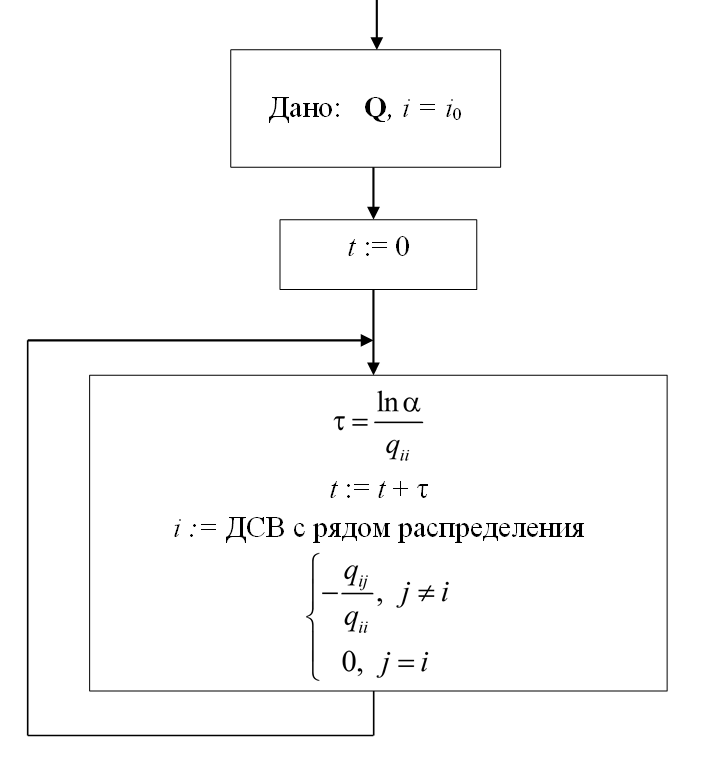
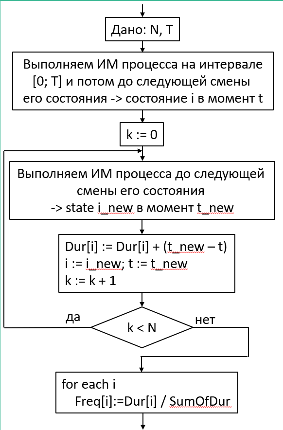
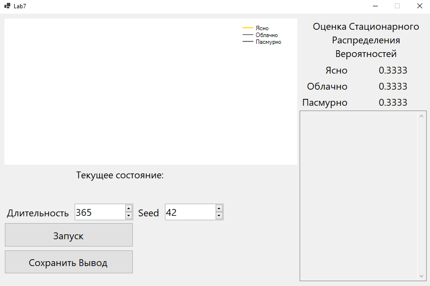
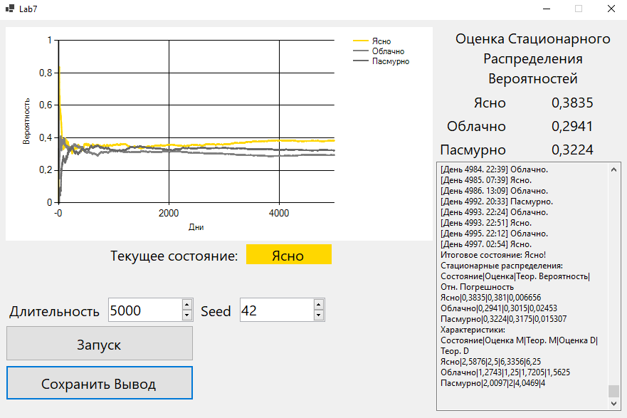

### Лабораторная работа №7
**Задача**
Смоделировать погоду по дням:  
  
1 — ясно  
2 — облачно  
3 — пасмурно  
  
Единица времени — 1 день.  
Задать интенсивности переходов между состояниями.  
**Решение**  
Приложение было написано на языке *C#* в *Visual Studio* с помощью *WinForms*.  
Матрица интенсивности переходов между состояниями:  
  
$$
\begin{pmatrix}
-0.4 & 0.3 & 0.1 \\
0.4 & -0.8 & 0.4 \\
0.1 & 0.4 & -0.5
\end{pmatrix}
$$

Для определения момента наступления перехода использовалась схема:  
  
Для нахождения оценки стационарного распределения вероятностей использовалась схема:  
  
**Пример**  
Интерфейс программы при запуске:  
  
Интерфейс программы в конце моделирования (длительность = 5000, seed = 42):  
   
Итоговые данные по стационарному распределению вероятностей (длительность = 5000, seed = 42):  

|Состояние|Оценка|Теор. Значение|Отн. Ошибка|  
|---|---|---|---|  
|Ясно|0.3835|0.381|0.006656|  
|Облачно|0.2941|0.3015|0.02453|  
|Пасмурно|0.3224|0.3175|0.015307|  

**Вывод**  
С помощью мультипликативного конгруэнтного генератора, а также двух  
схем показанных выше можно довольно эффективно моделировать  
марковскую цепь с непрерывным временем.  
