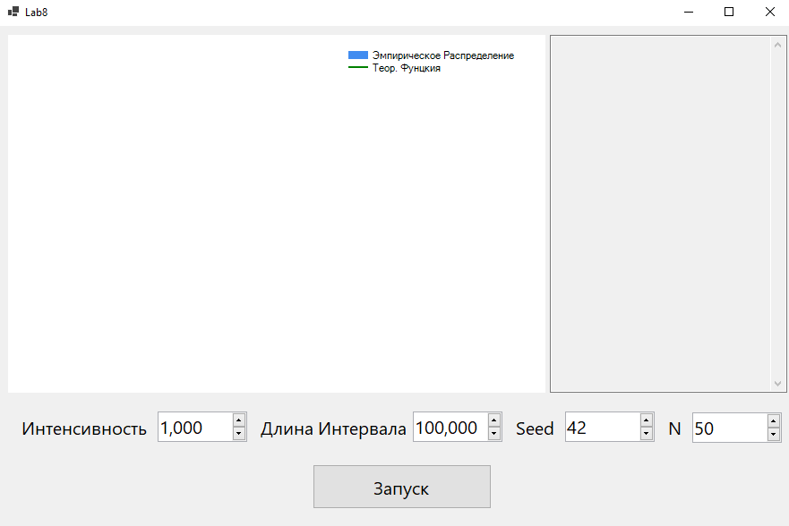
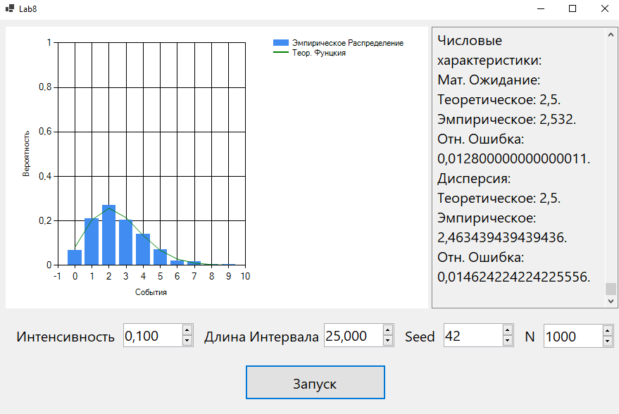

### Лабораторная работа №8
**Задача**  
Моделирование потока запросов на сервер  
Использовать модель простейшего потока событий, где событие — это поступление запроса на сервер.  
- определить число запросов за интервал времени T (выбрать самостоятельно)  
- построить эмпирическое распределение числа запросов за интервал времени T  
- вычислить среднее и дисперсию числа запросов за интервал времени T  
- сделать вывод  

**Решение**  
Приложение было написано на языке *C#* в *Visual Studio* с помощью *WinForms*.  
Время в стартовой точке ($t_0$) будет равняться 0.  
Будем высчитывать время наступления события $i + 1$ по формуле:  

$$
t_{i+1} = t_i + (- \frac{\ln \alpha}{\lambda})
$$  

где $\alpha$ - псевдослучайное число полученное из  
**мультипликативного конгруэнтного генератора**, а  
$\lambda$ - заданная интенсивность наступления событий.  
Так будем считать количество наступивших события за период $T$.  
Проведём $N$ наблюдени и количество событий в каждом наблюдении занесём в список.  
Далее подсчитаем сначал абсолютную частоту выпадения $i$-го количества событий ($freq_i$),  
а после и относительную частоту ($relFreq_i$) по формуле: 

$$
relFreq_i = \frac{freq_i}{N}
$$  

По относительным частотам построим столбчатую диаграмму, являющуюся  
оценкой *функции вероятности*.  
Для сравнения построим теоретическую *функцию вероятности* по формуле:  

$$
P_k = \frac{(\lambda T)^k e^{-\lambda T}}{k!}
$$  

Сведя её к реккурентному соотношению:  

$$
P_k = P_{k-1} \frac{\lambda T}{k}
$$  

После подсчитаем теоретические *мат. ожидание* и *дисперсию*:  

$$
E = \lambda T
\quad
Var = \lambda T
$$  

Также подсчитаем эмпирические *мат. ожидание* и *дисперсию*:

$$
\hat{E} = \frac{1}{N} \sum\limits_{i=1}^{N} x_i
\quad
\hat{Var} = \frac{1}{N - 1} \sum\limits_{i=1}^{N} (x_i - \hat{E})^2
$$

Также высчитаем соответствующие относительные ошибки:  

$$
\delta_E = \frac{|\hat{E} - E|}{E}
\quad
\delta_{Var} = \frac{|\hat{Var} - Var|}{Var}
$$

**Пример**  
Интерфейс программы при запуске:  
  
Интерфейс после моделирования с параметрами  
$\lambda$ = 0.1, $T$ = 25, $Seed$ = 42, $N$ = 1000:  
  
Получился неплохой результат:  

||Теоретическая|Эмпирическая|Отн. Ошибка|
|---|---|---|---|
|Мат. Ожидание|2.5|2.532|0.0128|
|Дисперсия|2.5|2.4634|0.0146|

**Вывод**  
*Простейший поток событий* очень легко моделировать используя  
**мультипликативный конгруэнтный генератор** и зная формулу расчёта  
времени наступления следующего события $t_{i+1}$.  
