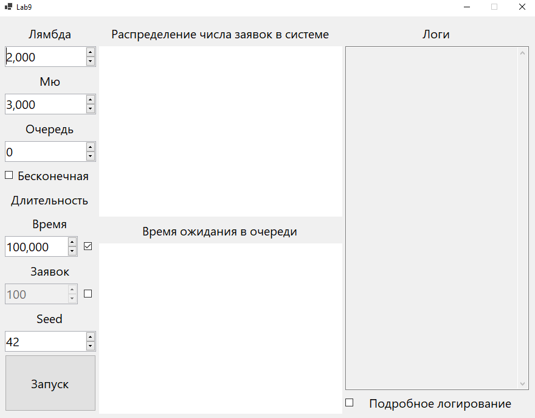
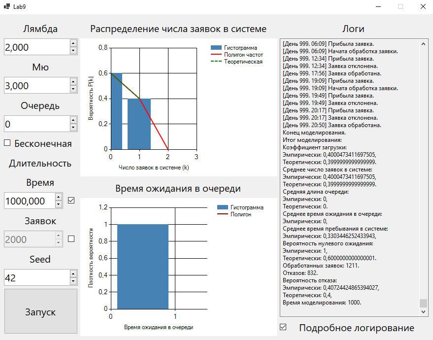
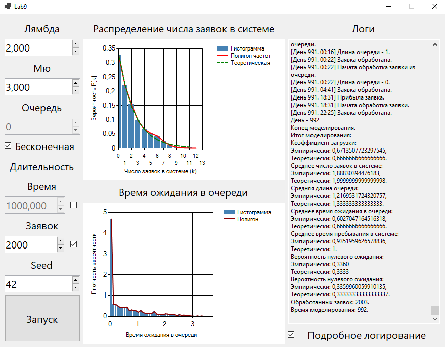

### Лабораторная работа №9  
**Задача**  
Моделирование простейшей системы M/M/1.  
**Решение**  
Приложение было написано на языке *C#* в *Visual Studio* с помощью *WinForms*.  
Интерфейс программы при запуске:  
  
Интерфейс программы после запуска со следующими параметрами:  
$\lambda = 2$, $\mu = 3$, длина очереди = 0,  
время моделирования = 1000, seed = 42:  
  
Результаты:  
||Теоретическая|Эмпирическая|
|---|---|---|
|Коэффициент Загрузки|0.4|0.4|
|Ср. Число Заявок в Системе|0.4|0.4|
|Ср. Длина Очереди|0|0|
|Вероятность Нулевого Ожидания|0.6|0.593|
|Вероятность Отказа|0.4|0.407|  

Интерфейс программы после запуска со следующими параметрами:  
$\lambda = 2$, $\mu = 3$, бесконечная очередь,  
моделирование до 2000 обработанных заявок, seed = 42:  
  
Результаты:  
||Теоретическая|Эмпирическая|
|---|---|---|
|Коэффициент Загрузки|0.667|0.671|
|Ср. Число Заявок в Системе|2|1.888|
|Ср. Длина Очереди|1.333|1.217|
|Ср. Время Ожидания В Очереди|0.667|0.603|
|Ср. Время Пребывания В Системе|1|0.935|
|Вероятность Нулевого Ожидания|0.333|0.336|  
  
**Вывод**  
Систему массового обслуживания с одним обработчиком довольно  
просто реализовать с помощью **мультипликативного конгруэнтного генератора**    
и модели простейшего потока.  
