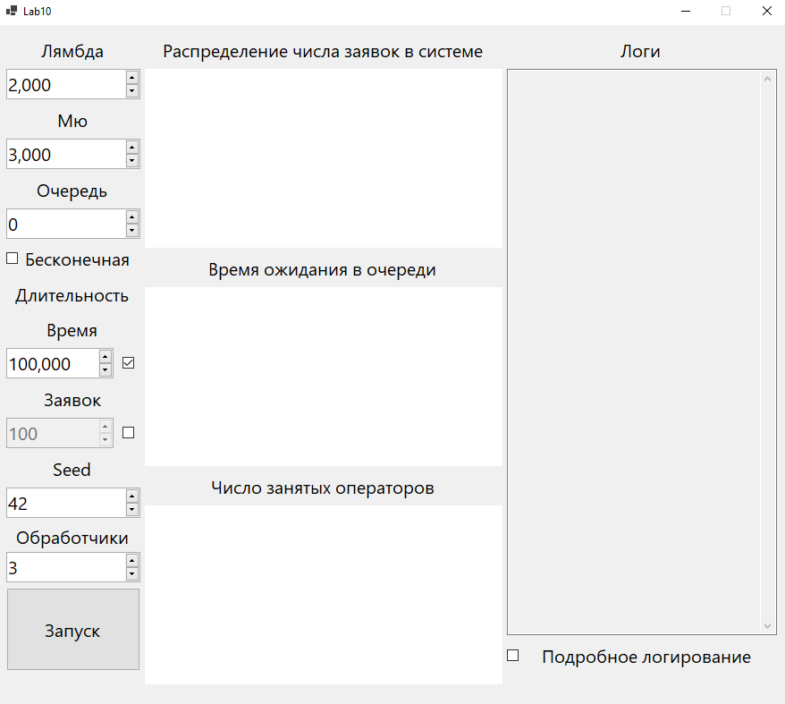
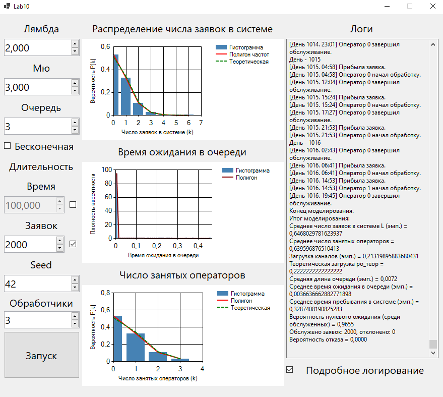
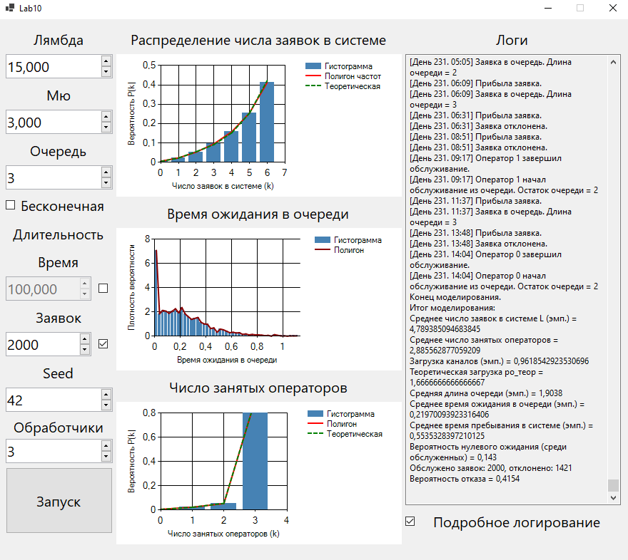

### Лабораторная работа №10  
**Задача**  
Реализовать систему M/M/* с **двумя дополнительными правилами** (ООП).  
Дополнительные правила:  
1. Ограничение числа приборов.
2. Очередь.
3. GUI.

**Решение**  
Приложение было написано на языке *C#* в *Visual Studio* с помощью *WinForms*.  
Интерфейс программы при запуске:  
  
Интерфейс программы после запуска со следующими параметрами:  
$\lambda = 2$, $\mu = 3$, длина очереди = 3,  
моделирование до 200 обработанных заявок, seed = 42, 3 обработчика:  
  
Результаты:  
||Значение|
|---|---|
|Ср. Число Заявок В Системе|0.647|
|Ср. Число Занятых Операторов|0.64|
|Загрузка Каналов|0.213|
|Ср. Время Ожидания В Очереди|0.004|
|Ср. Время Пребывания В Системе|0.329|
|Вероятность Нулевого Ожидания (Среди Обслуженных)|0.988|
|Вероятность Отказа|0|

Интерфейс программы после запуска со следующими параметрами:  
$\lambda = 15$, $\mu = 3$, длина очереди = 3,  
моделирование до 200 обработанных заявок, seed = 42, 3 обработчика:  
  
Результаты:  
||Значение|
|---|---|
|Ср. Число Заявок В Системе|4.789|
|Ср. Число Занятых Операторов|2.886|
|Загрузка Каналов|0.962|
|Cр. Длина Очереди|1.904|
|Ср. Время Ожидания В Очереди|0.22|
|Ср. Время Пребывания В Системе|0.554|
|Вероятность Нулевого Ожидания (Среди Обслуженных)|0.143|
|Вероятность Отказа|0.415|
  
**Вывод**  
Систему массового обслуживания с несколькими обработчиками довольно  
просто реализовать с помощью **мультипликативного конгруэнтного генератора**    
и модели простейшего потока.  
